# Phase 8.5 native visual evidence

These are native component fixtures, visually inspected. Sample titles, peer names and pairing
digits are synthetic. No screenshot establishes authentication, actual audio or physical riding UX.
See the [audit and validation ledger](../../PHASE8_5_UI_POLISH.md) for configurations and limits.

| iPhone 17 Pro Max, standard text | iPhone 17e, XXXL text |
|---|---|
| 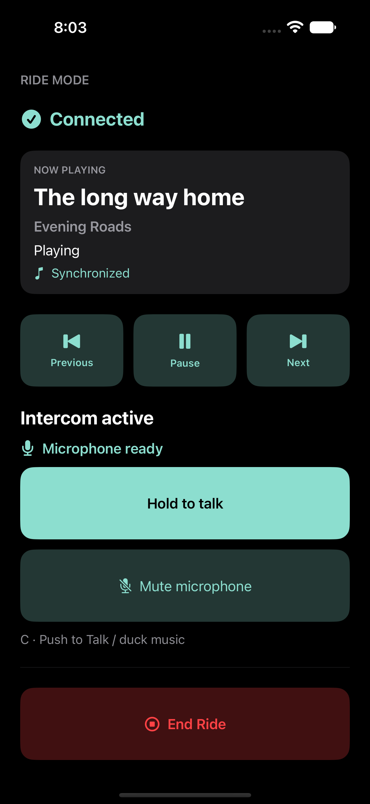 | 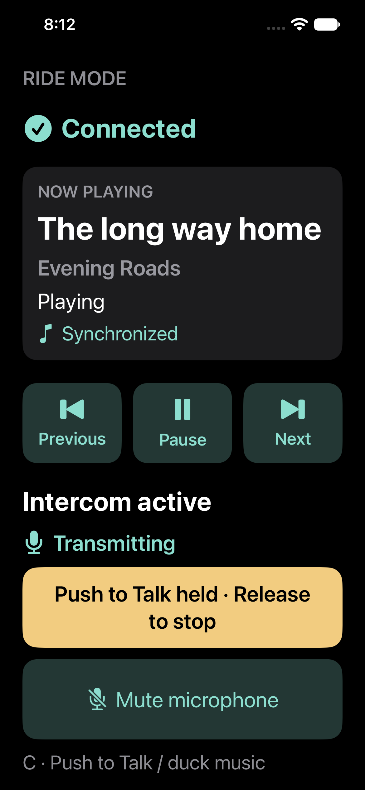 |

| iPhone 17e pairing, dark and XXXL | iPhone 17e queue, dark and XXXL |
|---|---|
| 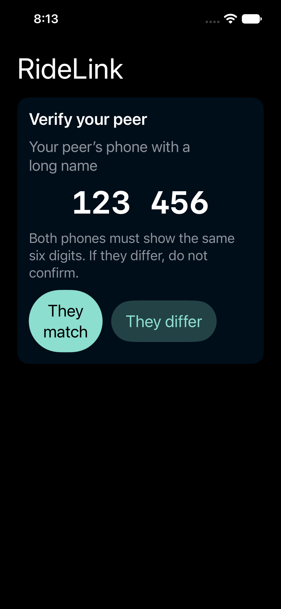 | 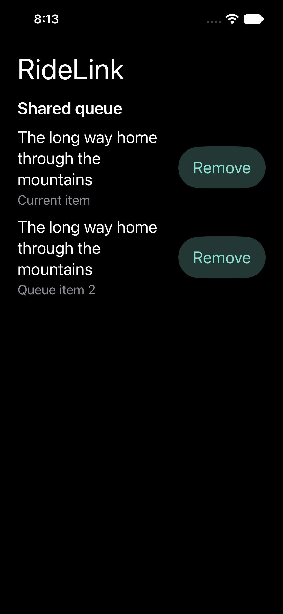 |

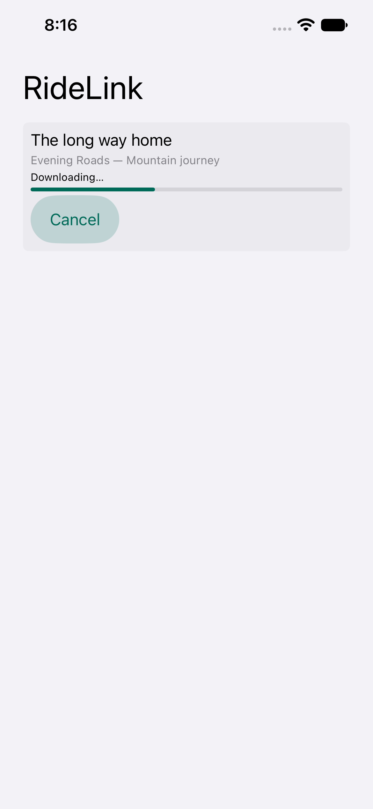

| iPhone 17e, enlarged text and scrolled | iPhone 17e, library keyboard |
|---|---|
| 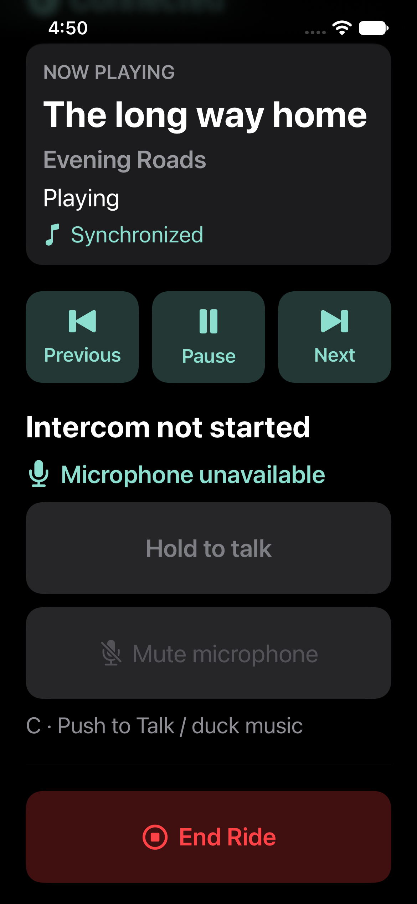 | 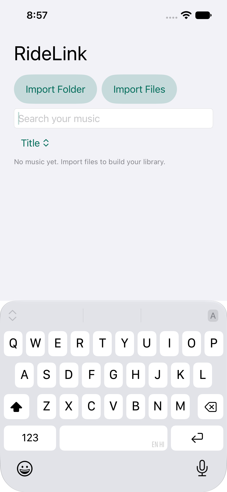 |

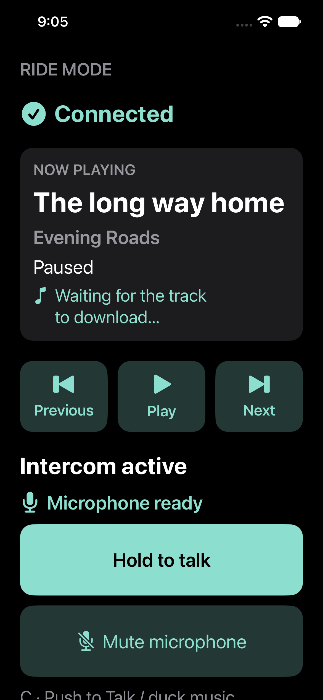

| Android large phone, standard text | Android 360 × 640 dp, 150% text, scrolled |
|---|---|
| 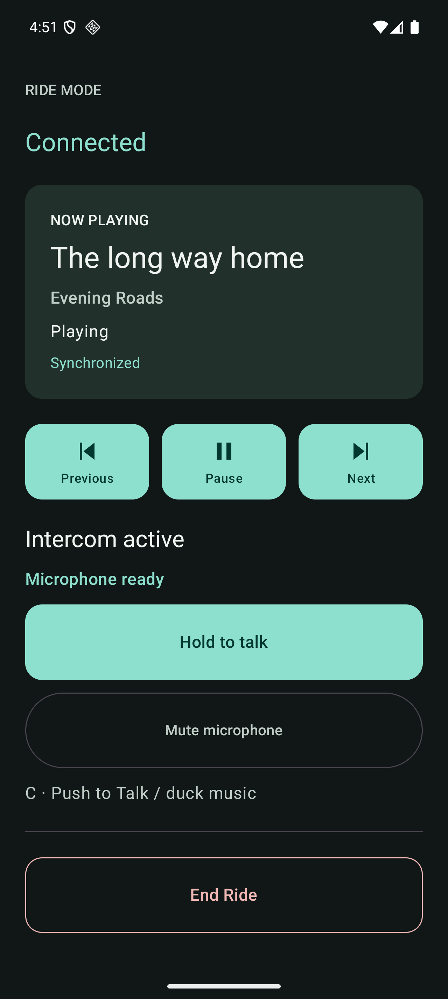 | 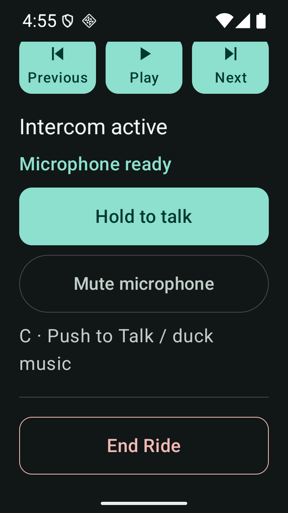 |

| Android pairing, 150% text | Android music, 150% text |
|---|---|
| 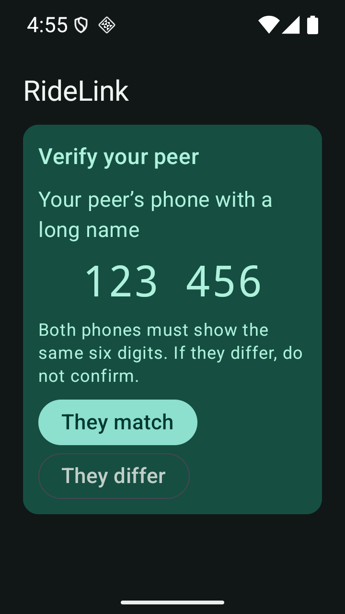 | 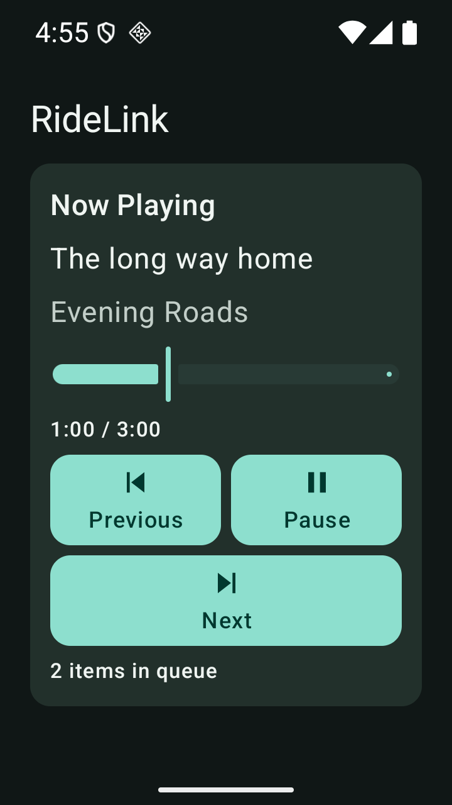 |

| Android voice permission guidance, 150% text | Android library keyboard, 150% text |
|---|---|
| 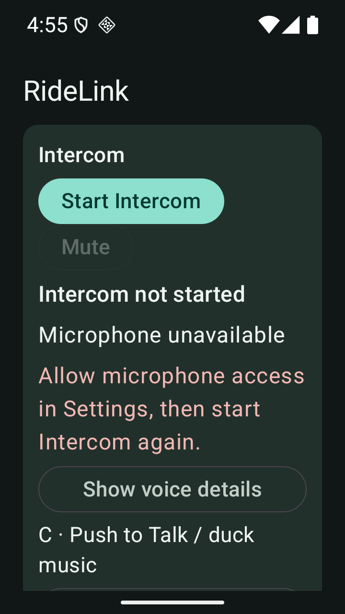 | 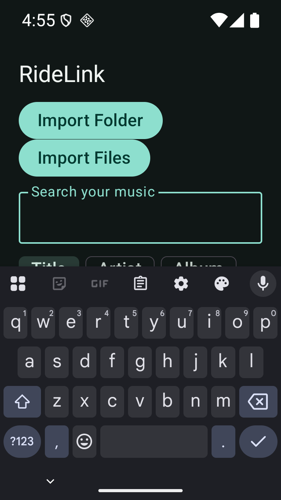 |
